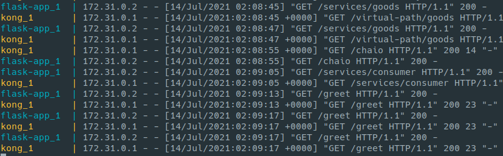

# kongs

## Demo Kong functions with docker-compose

1. Run Kong and simple Flask application

    ```bash
    docker-compose up --build
    ```

2. Test Kong with some HTTP requests

   - Install **rest-client** on VSCode
   - Send HTTP requests (Ctrl + Alt + R)

3. Results


